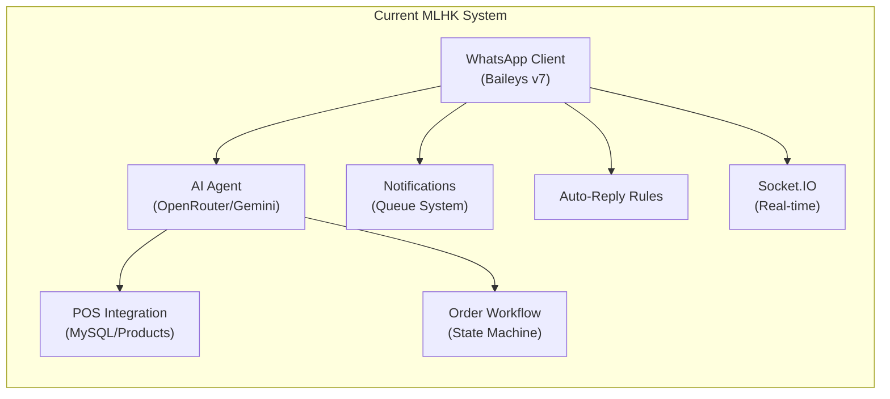
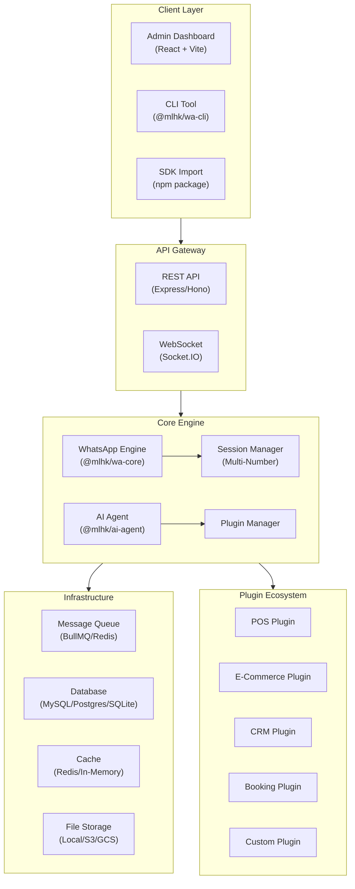
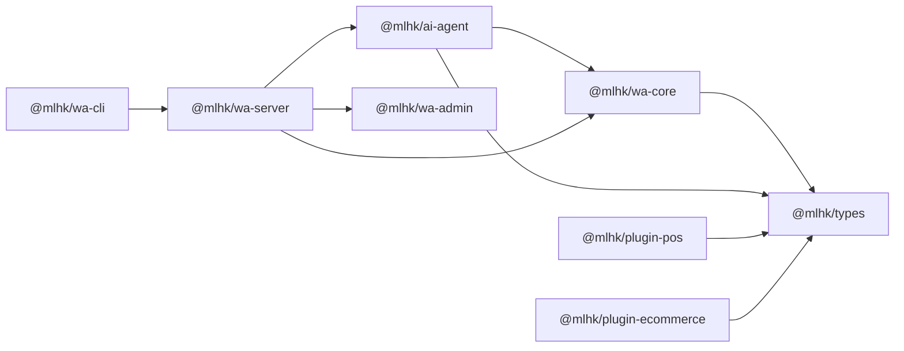
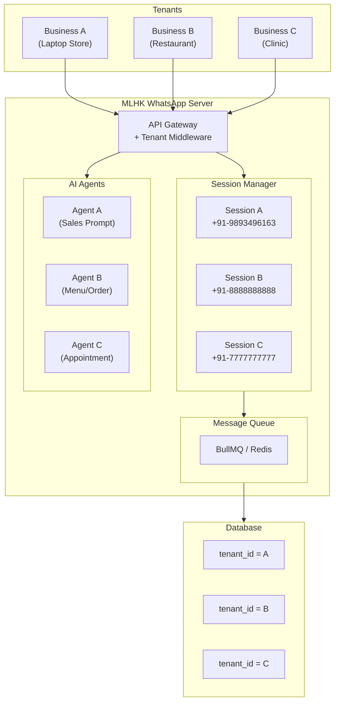
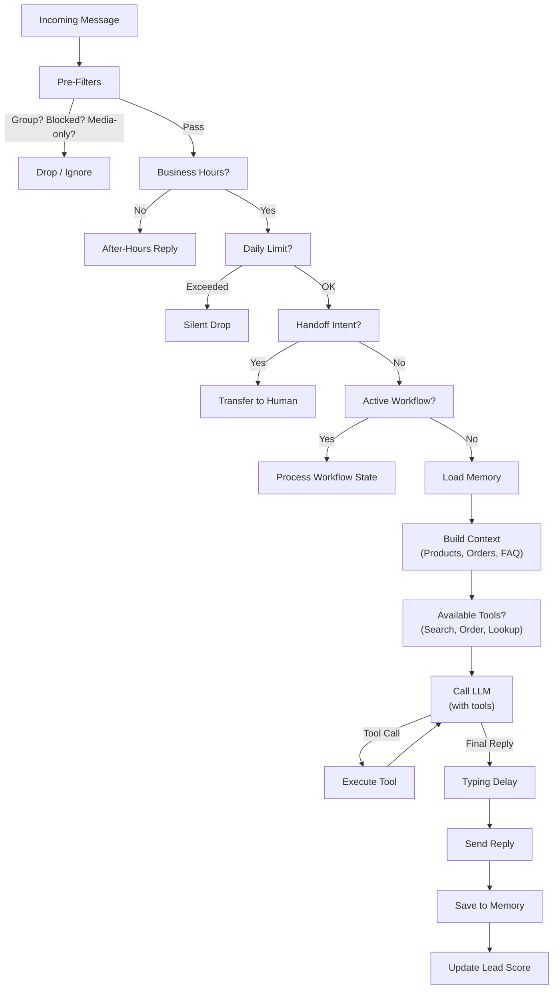

# 🚀 MLHK AI WhatsApp Ecosystem — Complete Blueprint

> **Version:** 2.0 | **Date:** October 2026  
> **Author:** MLHK Engineering | **Status:** Master Plan  
> **Goal:** Existing AI WhatsApp Agent ko ek **production-grade, publishable, multi-client npm ecosystem** mein convert karna — jo kisi bhi business/client ke liye plug-and-play deploy ho sake.

---

## 📋 Table of Contents

1. [Executive Summary](#1-executive-summary)
2. [Current System Analysis (What We Have)](#2-current-system-analysis)
3. [Market Research & Competitive Landscape](#3-market-research--competitive-landscape)
4. [Vision: What We're Building](#4-vision-what-were-building)
5. [Architecture Overview](#5-architecture-overview)
6. [Monorepo Package Structure](#6-monorepo-package-structure)
7. [Package #1: @mlhk/wa-core — WhatsApp Engine](#7-package-1-mlhkwa-core--whatsapp-engine)
8. [Package #2: @mlhk/ai-agent — AI Brain](#8-package-2-mlhkai-agent--ai-brain)
9. [Package #3: @mlhk/wa-server — Ready-to-Deploy Server](#9-package-3-mlhkwa-server--ready-to-deploy-server)
10. [Package #4: @mlhk/wa-admin — Admin Dashboard UI](#10-package-4-mlhkwa-admin--admin-dashboard-ui)
11. [Package #5: @mlhk/wa-cli — CLI Tool](#11-package-5-mlhkwa-cli--cli-tool)
12. [Multi-Tenant Architecture](#12-multi-tenant-architecture)
13. [Database Design](#13-database-design)
14. [Plugin System Architecture](#14-plugin-system-architecture)
15. [API Design (REST + WebSocket)](#15-api-design-rest--websocket)
16. [AI Agent Deep Dive](#16-ai-agent-deep-dive)
17. [WhatsApp Features Roadmap](#17-whatsapp-features-roadmap)
18. [Security & Production Hardening](#18-security--production-hardening)
19. [Deployment Strategies](#19-deployment-strategies)
20. [Implementation Phases & Timeline](#20-implementation-phases--timeline)
21. [File-by-File Migration Plan](#21-file-by-file-migration-plan)
22. [Tech Stack Final Decision](#22-tech-stack-final-decision)

---

## 1. Executive Summary

### 🎯 Kya Hai Ye?

Hum ek **complete WhatsApp AI Agent ecosystem** bana rahe hain jo:

| Feature | Description |
|---------|-------------|
| **npm Package** | `npm install @mlhk/wa-core` se koi bhi developer apne project mein integrate kar sake |
| **Multi-Client** | Ek server par **multiple businesses** apna WhatsApp connect kar sakein (SaaS model) |
| **AI-Powered** | OpenAI, Gemini, OpenRouter, Ollama — koi bhi LLM plugin karke use kar sake |
| **QR Login** | Admin panel se QR scan karke WhatsApp connect — no Business API needed initially |
| **Plugin System** | E-commerce, CRM, POS, Booking — har industry ke liye plugins |
| **Admin Dashboard** | React-based admin panel — chats, AI settings, analytics, broadcast |
| **CLI Tool** | `npx @mlhk/wa-cli init` se naya project bootstrap |
| **TypeScript-First** | Poora ecosystem TypeScript mein — type safety + better DX |
| **Production-Ready** | Docker, Redis queue, rate limiting, session encryption, crash recovery |

### 💰 Business Model Options

```
┌─────────────────────────────────────────────────┐
│  1. Open-Source Core + Premium Plugins           │
│  2. SaaS Platform (monthly per-number pricing)   │
│  3. White-Label Solution for agencies            │
│  4. Enterprise Self-Hosted License               │
└─────────────────────────────────────────────────┘
```

---

## 2. Current System Analysis

### ✅ Jo Humne Pehle Se Banaya Hai (Strengths)



| Component | File | Status | Quality |
|-----------|------|--------|---------|
| WhatsApp Connection (Baileys) | `client.js` (595 lines) | ✅ Working | ⭐⭐⭐⭐ Solid |
| AI Agent Brain | `agent.js` (878 lines) | ✅ Working | ⭐⭐⭐⭐ Feature-rich |
| Database Layer | `database.js` (244 lines) | ✅ Working | ⭐⭐⭐ MySQL-only |
| Notification System | `notifications.js` (170 lines) | ✅ Working | ⭐⭐⭐⭐ Queue-based |
| REST API Routes | `whatsapp.js` (820 lines) | ✅ Working | ⭐⭐⭐⭐ Comprehensive |
| Entry Point | `index.js` (165 lines) | ✅ Working | ⭐⭐⭐ Monolithic |
| Lead Scoring | `messageScheduler.js` | ✅ Working | ⭐⭐⭐ Basic |
| Shop Notifications | `shopNotifications.js` | ✅ Working | ⭐⭐⭐ POS-specific |

### 🏗️ Current Architecture (What Needs to Change)

| Problem | Impact | Solution |
|---------|--------|----------|
| **Single-tenant** | Sirf ek WhatsApp number support | Multi-session manager |
| **Tightly coupled to POS** | Dusre business type mein reuse nahi ho sakta | Plugin-based adapters |
| **MySQL hardcoded** | PostgreSQL/MongoDB use nahi kar sakte | Database adapter pattern |
| **No TypeScript** | Type errors runtime pe aate hain | Full TypeScript migration |
| **Monolith structure** | npm package banana mushkil | Modular monorepo |
| **No encryption** | Session data plain text | AES-256 encryption |
| **No Redis/Queue** | Heavy load pe message loss | BullMQ/Redis queue |
| **Business-specific text** | "AI Laptopwala" hardcoded | Config-driven templates |

### 📊 Current Tech Debt Score

```
Code Quality:     ████████░░ 8/10  (Clean, readable)
Architecture:     ██████░░░░ 6/10  (Monolithic, single-tenant)
Scalability:      ████░░░░░░ 4/10  (No queue, no clustering)
Security:         █████░░░░░ 5/10  (Basic auth, no encryption)
Reusability:      ███░░░░░░░ 3/10  (POS-specific, hardcoded)
Test Coverage:    █░░░░░░░░░ 1/10  (No tests)
```

---

## 3. Market Research & Competitive Landscape

### 🔍 WhatsApp Bot Frameworks (npm)

| Framework | Type | Pros | Cons | Stars |
|-----------|------|------|------|-------|
| **@whiskeysockets/baileys** | Unofficial WS | Fast, lightweight, multi-device | Unofficial, ban risk | 7k+ |
| **whatsapp-web.js** | Unofficial Puppeteer | Beginner-friendly | Heavy (Chromium), slower | 15k+ |
| **@builderbot/bot** | Meta-framework | Provider-agnostic, flows | Newer, smaller community | 2k+ |
| **Meta Cloud API** | Official | Compliant, no ban risk | Paid, requires Business verification | N/A |

### 🤖 AI Agent Frameworks (2025-2026)

| Framework | Best For | Our Use |
|-----------|----------|---------|
| **LangGraph.js** | Complex multi-step workflows, HITL | ⭐ Agent orchestration |
| **Mastra** | TypeScript-native, batteries-included | ⭐ Strong alternative |
| **Vercel AI SDK** | Full-stack React + Edge | UI streaming responses |
| **OpenAI Agents SDK** | OpenAI-locked, fast | Fallback option |

### 🏆 Competitor Analysis

| Platform | Pricing | Gap We Fill |
|----------|---------|-------------|
| **WATI** | $49-299/mo | No self-hosted, no AI Agent |
| **Interakt** | $15-100/mo | Limited AI, India-focused |
| **Twilio** | Per-message | Complex setup, expensive |
| **Respond.io** | $79-349/mo | Generic, not AI-first |
| **Botpress** | Free-$500/mo | No WhatsApp focus |

### 🎯 Market Gap (OUR OPPORTUNITY)

> [!IMPORTANT]
> **Koi bhi npm package market mein nahi hai jo ye sab ek saath de:**
> 1. ✅ WhatsApp QR login + Cloud API — dono support
> 2. ✅ AI Agent with tool-calling & memory
> 3. ✅ Multi-tenant session management
> 4. ✅ Plugin system (POS, CRM, E-commerce)
> 5. ✅ Ready-to-deploy admin dashboard
> 6. ✅ CLI for project scaffolding
> 7. ✅ TypeScript-first, production-grade

**Hum "Next.js for WhatsApp AI" ban sakte hain!**

---

## 4. Vision: What We're Building

### 🌟 One-Line Vision

> **"Koi bhi developer, kisi bhi business ke liye, 5 minute mein AI-powered WhatsApp agent deploy kar sake."**

### 🎯 The Developer Experience We Want

```bash
# Step 1: Create new project
npx @mlhk/wa-cli create my-whatsapp-bot

# Step 2: Configure
cd my-whatsapp-bot
cp .env.example .env
# Edit .env with your API keys

# Step 3: Run
npm run dev

# → Opens admin panel at localhost:3000
# → Scan QR code
# → AI agent starts responding!
```

### 🏗️ For Existing Clients (Like Our POS)

```bash
# Install as dependency in any Node.js project
npm install @mlhk/wa-core @mlhk/ai-agent @mlhk/plugin-pos

# In your code:
import { WhatsAppEngine } from '@mlhk/wa-core';
import { AIAgent } from '@mlhk/ai-agent';
import { POSPlugin } from '@mlhk/plugin-pos';

const engine = new WhatsAppEngine({ sessionPath: './data' });
const agent = new AIAgent({ provider: 'gemini', apiKey: '...' });

engine.use(agent);
engine.use(new POSPlugin({ dbHost: '...', dbName: '...' }));

await engine.start();
```

---

## 5. Architecture Overview

### 🏛️ High-Level Architecture



### 🧩 Module Dependency Graph



---

## 6. Monorepo Package Structure

### 📁 Directory Layout

```
mlhk-whatsapp-ai/
├── package.json                    # Root workspace config
├── pnpm-workspace.yaml            # pnpm workspace definition
├── turbo.json                     # Turborepo build pipeline
├── tsconfig.base.json             # Shared TypeScript config
├── .changeset/                    # Changesets for versioning
│   └── config.json
├── .github/
│   └── workflows/
│       ├── ci.yml                 # Test + Lint on PR
│       ├── publish.yml            # Auto-publish to npm
│       └── docker.yml             # Docker image build
│
├── packages/
│   ├── types/                     # @mlhk/types — Shared TypeScript types
│   │   ├── package.json
│   │   ├── tsconfig.json
│   │   └── src/
│   │       ├── index.ts
│   │       ├── whatsapp.ts        # WA message types, events
│   │       ├── agent.ts           # AI agent interfaces
│   │       ├── plugin.ts          # Plugin interface contracts
│   │       ├── database.ts        # DB adapter interfaces
│   │       └── config.ts          # Configuration schemas
│   │
│   ├── wa-core/                   # @mlhk/wa-core — WhatsApp Engine
│   │   ├── package.json
│   │   ├── tsconfig.json
│   │   ├── tsup.config.ts         # Build config (ESM + CJS)
│   │   └── src/
│   │       ├── index.ts           # Public API exports
│   │       ├── engine.ts          # Main WhatsApp engine class
│   │       ├── providers/
│   │       │   ├── baileys.ts     # Baileys provider (QR login)
│   │       │   ├── cloud-api.ts   # Meta Cloud API provider
│   │       │   └── provider.ts    # Provider interface
│   │       ├── session/
│   │       │   ├── manager.ts     # Multi-session manager
│   │       │   ├── store.ts       # Session storage (file/redis)
│   │       │   └── encryption.ts  # AES-256 session encryption
│   │       ├── messages/
│   │       │   ├── handler.ts     # Message routing & filtering
│   │       │   ├── media.ts       # Media download/upload
│   │       │   ├── interactive.ts # Buttons, Lists, Flows
│   │       │   └── templates.ts   # Message template engine
│   │       ├── contacts/
│   │       │   ├── manager.ts     # Contact CRUD
│   │       │   └── groups.ts      # Group management
│   │       ├── notifications/
│   │       │   ├── queue.ts       # Notification queue
│   │       │   ├── processor.ts   # Background processor
│   │       │   └── templates.ts   # Notification templates
│   │       └── utils/
│   │           ├── phone.ts       # Phone number normalization
│   │           ├── jid.ts         # JID utilities
│   │           └── logger.ts      # Structured logging (pino)
│   │
│   ├── ai-agent/                  # @mlhk/ai-agent — AI Brain
│   │   ├── package.json
│   │   ├── tsconfig.json
│   │   └── src/
│   │       ├── index.ts
│   │       ├── agent.ts           # Main agent orchestrator
│   │       ├── providers/
│   │       │   ├── openrouter.ts  # OpenRouter provider
│   │       │   ├── gemini.ts      # Google Gemini provider
│   │       │   ├── openai.ts      # OpenAI provider
│   │       │   ├── ollama.ts      # Ollama (local LLM) provider
│   │       │   └── provider.ts    # LLM provider interface
│   │       ├── memory/
│   │       │   ├── manager.ts     # Conversation memory
│   │       │   ├── buffer.ts      # Buffer memory (last N)
│   │       │   ├── summary.ts     # Summary memory (compress)
│   │       │   └── vector.ts      # Vector memory (RAG)
│   │       ├── tools/
│   │       │   ├── registry.ts    # Tool registry (function calling)
│   │       │   ├── builtin.ts     # Built-in tools (search, time, etc.)
│   │       │   └── schema.ts      # Tool JSON schema builder
│   │       ├── intents/
│   │       │   ├── detector.ts    # Intent detection engine
│   │       │   ├── buy.ts         # Buy intent
│   │       │   ├── handoff.ts     # Human handoff intent
│   │       │   ├── faq.ts         # FAQ intent
│   │       │   └── custom.ts      # Custom intent registration
│   │       ├── workflows/
│   │       │   ├── engine.ts      # State machine for multi-step flows
│   │       │   ├── order.ts       # Order placement workflow
│   │       │   └── survey.ts      # Survey/feedback workflow
│   │       ├── prompts/
│   │       │   ├── builder.ts     # System prompt builder
│   │       │   ├── templates.ts   # Prompt templates library
│   │       │   └── injection.ts   # Context injection (products, history)
│   │       └── safety/
│   │           ├── guard.ts       # Content moderation
│   │           ├── rate-limit.ts  # Per-contact rate limiting
│   │           └── hours.ts       # Business hours checker
│   │
│   ├── wa-server/                 # @mlhk/wa-server — Ready-to-deploy server
│   │   ├── package.json
│   │   ├── tsconfig.json
│   │   ├── Dockerfile
│   │   ├── docker-compose.yml
│   │   └── src/
│   │       ├── index.ts           # Server entry point
│   │       ├── app.ts             # Express/Hono app setup
│   │       ├── config.ts          # Environment config loader
│   │       ├── routes/
│   │       │   ├── whatsapp.ts    # WhatsApp management routes
│   │       │   ├── agent.ts       # AI agent routes
│   │       │   ├── admin.ts       # Admin panel routes
│   │       │   ├── webhooks.ts    # External webhook handlers
│   │       │   └── health.ts      # Health check routes
│   │       ├── middleware/
│   │       │   ├── auth.ts        # JWT + API token auth
│   │       │   ├── tenancy.ts     # Multi-tenant middleware
│   │       │   ├── rate-limit.ts  # API rate limiting
│   │       │   └── cors.ts        # CORS configuration
│   │       ├── websocket/
│   │       │   ├── server.ts      # Socket.IO server
│   │       │   └── events.ts      # WebSocket event handlers
│   │       └── jobs/
│   │           ├── queue.ts       # BullMQ queue setup
│   │           ├── message.ts     # Message processing job
│   │           └── scheduler.ts   # Cron-based schedulers
│   │
│   ├── wa-admin/                  # @mlhk/wa-admin — Admin Dashboard
│   │   ├── package.json
│   │   ├── tsconfig.json
│   │   ├── vite.config.ts
│   │   └── src/
│   │       ├── App.tsx
│   │       ├── main.tsx
│   │       ├── pages/
│   │       │   ├── Dashboard.tsx   # Overview + analytics
│   │       │   ├── Chats.tsx       # Chat interface (like WhatsApp Web)
│   │       │   ├── AISettings.tsx  # AI agent configuration
│   │       │   ├── Contacts.tsx    # Contact/Lead management
│   │       │   ├── Broadcast.tsx   # Bulk messaging
│   │       │   ├── Templates.tsx   # Message templates
│   │       │   ├── Plugins.tsx     # Plugin marketplace
│   │       │   ├── Settings.tsx    # Global settings
│   │       │   └── Login.tsx       # Auth page
│   │       ├── components/
│   │       │   ├── QRScanner.tsx   # QR code display
│   │       │   ├── ChatBubble.tsx  # Chat message bubble
│   │       │   ├── LeadCard.tsx    # Lead score card
│   │       │   └── ...
│   │       └── hooks/
│   │           ├── useSocket.ts    # WebSocket hook
│   │           └── useAPI.ts       # API client hook
│   │
│   └── wa-cli/                    # @mlhk/wa-cli — CLI Tool
│       ├── package.json           # bin: { "mlhk-wa": "dist/cli.js" }
│       ├── tsconfig.json
│       └── src/
│           ├── cli.ts             # Main CLI entry
│           ├── commands/
│           │   ├── create.ts      # Create new project
│           │   ├── dev.ts         # Run development server
│           │   ├── deploy.ts      # Deploy to cloud
│           │   └── plugin.ts      # Install/manage plugins
│           └── templates/
│               ├── default/       # Default project template
│               ├── minimal/       # Minimal (core only)
│               └── full/          # Full (server + admin)
│
├── plugins/                       # Official Plugin Packages
│   ├── plugin-pos/                # @mlhk/plugin-pos (Our POS)
│   │   ├── package.json
│   │   └── src/
│   │       ├── index.ts
│   │       ├── products.ts        # Product search from DB
│   │       ├── orders.ts          # Order creation
│   │       ├── contacts.ts        # Contact/Lead management
│   │       └── invoices.ts        # Invoice generation
│   │
│   ├── plugin-ecommerce/          # @mlhk/plugin-ecommerce
│   │   └── src/
│   │       ├── shopify.ts         # Shopify integration
│   │       ├── woocommerce.ts     # WooCommerce integration
│   │       └── catalog.ts         # WhatsApp catalog sync
│   │
│   ├── plugin-crm/                # @mlhk/plugin-crm
│   │   └── src/
│   │       ├── hubspot.ts
│   │       ├── salesforce.ts
│   │       └── custom.ts
│   │
│   ├── plugin-booking/            # @mlhk/plugin-booking
│   │   └── src/
│   │       ├── calendar.ts
│   │       ├── slots.ts
│   │       └── reminders.ts
│   │
│   └── plugin-payments/           # @mlhk/plugin-payments
│       └── src/
│           ├── razorpay.ts
│           ├── stripe.ts
│           └── upi.ts
│
├── examples/                      # Example Projects
│   ├── basic-bot/                 # Minimal bot example
│   ├── ecommerce-bot/             # E-commerce bot
│   ├── pos-integration/           # POS integration (our setup)
│   └── multi-tenant-saas/         # SaaS deployment
│
├── docs/                          # Documentation
│   ├── getting-started.md
│   ├── api-reference.md
│   ├── plugin-development.md
│   ├── deployment.md
│   └── migration-from-v1.md
│
└── docker/                        # Docker configs
    ├── Dockerfile.server
    ├── Dockerfile.admin
    └── docker-compose.production.yml
```

---

## 7. Package #1: @mlhk/wa-core — WhatsApp Engine

### 🎯 Purpose
WhatsApp connectivity ka core — message send/receive, session management, multi-number support.

### 📦 Public API

```typescript
// @mlhk/wa-core — Main exports

export class WhatsAppEngine extends EventEmitter {
  constructor(config: EngineConfig);
  
  // Lifecycle
  start(): Promise<void>;
  stop(): Promise<void>;
  restart(): Promise<void>;
  
  // Session management (multi-number)
  addSession(id: string, config?: SessionConfig): Promise<Session>;
  removeSession(id: string): Promise<void>;
  getSession(id: string): Session | null;
  getAllSessions(): Map<string, Session>;
  
  // Messaging
  sendText(sessionId: string, to: string, text: string): Promise<MessageResult>;
  sendImage(sessionId: string, to: string, image: Buffer | string, caption?: string): Promise<MessageResult>;
  sendButtons(sessionId: string, to: string, buttons: Button[]): Promise<MessageResult>;
  sendList(sessionId: string, to: string, list: ListMessage): Promise<MessageResult>;
  sendTemplate(sessionId: string, to: string, template: string, vars: Record<string, string>): Promise<MessageResult>;
  
  // Contacts & Groups
  getContacts(sessionId: string): Promise<Contact[]>;
  getGroups(sessionId: string): Promise<Group[]>;
  getProfilePicture(sessionId: string, jid: string): Promise<string | null>;
  
  // Plugin system
  use(plugin: Plugin): void;
  
  // Events
  on(event: 'message', handler: (ctx: MessageContext) => void): this;
  on(event: 'message:image', handler: (ctx: MediaMessageContext) => void): this;
  on(event: 'session:qr', handler: (sessionId: string, qr: string) => void): this;
  on(event: 'session:ready', handler: (sessionId: string) => void): this;
  on(event: 'session:disconnected', handler: (sessionId: string, reason: string) => void): this;
}

// Configuration
interface EngineConfig {
  provider: 'baileys' | 'cloud-api';           // Which WhatsApp provider
  storage: StorageConfig;                        // Session storage
  queue?: QueueConfig;                           // Optional message queue
  encryption?: { key: string };                  // Session encryption
  logger?: LoggerConfig;                         // Logging config
  reconnect?: { maxAttempts: number; backoff: 'exponential' | 'linear' };
}

interface SessionConfig {
  phoneNumber?: string;                          // For Cloud API
  webhookUrl?: string;                           // For Cloud API
  browser?: [string, string, string];            // For Baileys
  sessionPath?: string;                          // Custom session path
  metadata?: Record<string, any>;                // Custom metadata (tenant info etc.)
}

// Message Context (passed to handlers)
interface MessageContext {
  sessionId: string;
  from: string;                                  // Sender JID
  fromName: string;                              // Push name
  to: string;                                    // Receiver
  body: string;                                  // Text content
  type: 'text' | 'image' | 'video' | 'audio' | 'document' | 'sticker' | 'location' | 'contact';
  isGroup: boolean;
  groupId?: string;
  quotedMessage?: { id: string; body: string };
  timestamp: Date;
  raw: any;                                      // Raw provider message
  
  // Helper methods
  reply(text: string): Promise<MessageResult>;
  replyWithImage(image: Buffer | string, caption?: string): Promise<MessageResult>;
  replyWithButtons(text: string, buttons: Button[]): Promise<MessageResult>;
  react(emoji: string): Promise<void>;
  markAsRead(): Promise<void>;
  getContact(): Promise<Contact | null>;
}
```

### 🔌 Provider Abstraction (Baileys ↔ Cloud API)

```typescript
// providers/provider.ts — Interface that both implement

interface WhatsAppProvider {
  name: string;
  
  connect(sessionId: string, config: SessionConfig): Promise<void>;
  disconnect(sessionId: string): Promise<void>;
  
  sendMessage(sessionId: string, jid: string, content: MessageContent): Promise<MessageResult>;
  downloadMedia(message: RawMessage): Promise<Buffer>;
  
  getStatus(sessionId: string): SessionStatus;
  getQR(sessionId: string): string | null;
  
  on(event: string, handler: (...args: any[]) => void): void;
}
```

> [!TIP]
> **Provider switch karna simple hoga:**
> ```typescript
> // Baileys (QR login — free, unofficial)
> const engine = new WhatsAppEngine({ provider: 'baileys' });
> 
> // Meta Cloud API (official — paid, no ban risk)
> const engine = new WhatsAppEngine({ provider: 'cloud-api' });
> ```
> Code change nahi hoga — sirf config change!

### 🔐 Session Encryption

```typescript
// session/encryption.ts
import { createCipheriv, createDecipheriv, randomBytes } from 'crypto';

export class SessionEncryption {
  private key: Buffer;
  
  constructor(masterKey: string) {
    // Derive 256-bit key from master key
    this.key = createHash('sha256').update(masterKey).digest();
  }
  
  encrypt(data: Buffer): Buffer {
    const iv = randomBytes(16);
    const cipher = createCipheriv('aes-256-cbc', this.key, iv);
    return Buffer.concat([iv, cipher.update(data), cipher.final()]);
  }
  
  decrypt(encrypted: Buffer): Buffer {
    const iv = encrypted.subarray(0, 16);
    const data = encrypted.subarray(16);
    const decipher = createDecipheriv('aes-256-cbc', this.key, iv);
    return Buffer.concat([decipher.update(data), decipher.final()]);
  }
}
```

### 📊 Multi-Session Manager

```typescript
// session/manager.ts

export class SessionManager {
  private sessions: Map<string, Session> = new Map();
  private provider: WhatsAppProvider;
  private store: SessionStore;
  
  async addSession(id: string, config: SessionConfig): Promise<Session> {
    if (this.sessions.has(id)) throw new Error(`Session ${id} already exists`);
    
    const session = new Session(id, config);
    this.sessions.set(id, session);
    
    // Auto-connect if previous session exists
    if (await this.store.exists(id)) {
      await this.provider.connect(id, config);
    }
    
    return session;
  }
  
  async removeSession(id: string): Promise<void> {
    await this.provider.disconnect(id);
    await this.store.delete(id);
    this.sessions.delete(id);
  }
  
  getSession(id: string): Session | null {
    return this.sessions.get(id) || null;
  }
  
  getAllSessions(): Map<string, Session> {
    return new Map(this.sessions);
  }
  
  getActiveCount(): number {
    return [...this.sessions.values()].filter(s => s.status === 'ready').length;
  }
}
```

---

## 8. Package #2: @mlhk/ai-agent — AI Brain

### 🎯 Purpose
LLM-powered conversational AI — intent detection, tool calling, memory, workflows.

### 📦 Public API

```typescript
// @mlhk/ai-agent — Main exports

export class AIAgent {
  constructor(config: AgentConfig);
  
  // Process incoming message → generate reply
  process(ctx: AgentContext): Promise<AgentResponse>;
  
  // Configuration
  setSystemPrompt(prompt: string): void;
  setProvider(provider: LLMProvider): void;
  
  // Tools (function calling)
  registerTool(tool: Tool): void;
  removeTool(name: string): void;
  
  // Memory
  getMemory(contactId: string): Promise<MemoryEntry[]>;
  clearMemory(contactId: string): Promise<void>;
  
  // Intents
  registerIntent(intent: IntentDefinition): void;
  
  // Workflows
  registerWorkflow(workflow: WorkflowDefinition): void;
  
  // Guards
  setBusinessHours(config: BusinessHoursConfig): void;
  setDailyLimit(limit: number): void;
  setContentGuard(guard: ContentGuard): void;
}

interface AgentConfig {
  // LLM Configuration
  provider: 'openrouter' | 'gemini' | 'openai' | 'ollama' | 'custom';
  apiKey?: string;
  model?: string;
  temperature?: number;
  maxTokens?: number;
  
  // System prompt
  systemPrompt?: string;
  language?: 'auto' | 'en' | 'hi' | 'hinglish';
  
  // Memory
  memory?: {
    type: 'buffer' | 'summary' | 'vector';
    limit?: number;                    // Buffer: last N messages
    store?: MemoryStore;               // Custom store (DB, Redis)
  };
  
  // Safety
  businessHours?: BusinessHoursConfig;
  dailyLimit?: number;
  contentModeration?: boolean;
  
  // Features
  features?: {
    typingIndicator?: boolean;
    replyDelay?: { min: number; max: number }; // seconds
    imageVision?: boolean;
    voiceTranscription?: boolean;
  };
}

// Agent Context (input)
interface AgentContext {
  contactId: string;
  contactName: string;
  message: string;
  imageData?: { mimeType: string; data: string };  // Base64
  metadata?: Record<string, any>;                    // Custom data from plugins
}

// Agent Response (output)
interface AgentResponse {
  reply: string;
  images?: ProductImage[];
  buttons?: Button[];
  listMessage?: ListMessage;
  
  // Metadata
  intent?: string;
  confidence?: number;
  tokensUsed?: number;
  model?: string;
  
  // Actions
  isHandoff?: boolean;          // Human takeover needed
  isFallback?: boolean;         // LLM failed, used fallback
  workflowState?: string;       // Current workflow state
  toolsCalled?: string[];       // Which tools were invoked
  
  // Custom data (from tools/plugins)
  data?: Record<string, any>;
}

// Tool Definition (for function calling)
interface Tool {
  name: string;
  description: string;
  parameters: JSONSchema;       // JSON Schema for params
  handler: (params: any, ctx: AgentContext) => Promise<any>;
}
```

### 🧠 LLM Provider Abstraction

```typescript
// providers/provider.ts

interface LLMProvider {
  name: string;
  
  chat(messages: ChatMessage[], options: LLMOptions): Promise<LLMResponse>;
  chatWithTools(messages: ChatMessage[], tools: ToolSchema[], options: LLMOptions): Promise<LLMToolResponse>;
  
  // Optional
  listModels?(): Promise<ModelInfo[]>;
  embed?(text: string): Promise<number[]>;  // For vector memory
}

interface ChatMessage {
  role: 'system' | 'user' | 'assistant' | 'tool';
  content: string | ContentPart[];
  toolCallId?: string;
  name?: string;
}

interface LLMResponse {
  content: string;
  finishReason: 'stop' | 'length' | 'tool_calls';
  usage: { promptTokens: number; completionTokens: number };
}

interface LLMToolResponse extends LLMResponse {
  toolCalls?: Array<{
    id: string;
    name: string;
    arguments: Record<string, any>;
  }>;
}
```

### 🔧 Tool Registry (Function Calling)

```typescript
// tools/registry.ts — Example: Product Search Tool

const productSearchTool: Tool = {
  name: 'search_products',
  description: 'Search products in the store inventory by name, category, brand, or price range',
  parameters: {
    type: 'object',
    properties: {
      query: { type: 'string', description: 'Search query text' },
      maxPrice: { type: 'number', description: 'Maximum price filter' },
      category: { type: 'string', description: 'Product category' },
      limit: { type: 'number', description: 'Max results', default: 5 }
    },
    required: ['query']
  },
  handler: async (params, ctx) => {
    // Plugin provides this — POS plugin searches MySQL, 
    // E-commerce plugin searches Shopify, etc.
    const products = await ctx.metadata?.searchProducts?.(params);
    return products || [];
  }
};

const orderLookupTool: Tool = {
  name: 'lookup_order',
  description: 'Look up an order by invoice number or customer phone',
  parameters: {
    type: 'object',
    properties: {
      query: { type: 'string', description: 'Invoice number or phone' }
    },
    required: ['query']
  },
  handler: async (params, ctx) => {
    return await ctx.metadata?.lookupOrder?.(params.query);
  }
};

const createOrderTool: Tool = {
  name: 'create_order',
  description: 'Create a new order for the customer',
  parameters: {
    type: 'object',
    properties: {
      productId: { type: 'number', description: 'Product ID to order' },
      quantity: { type: 'number', default: 1 },
      address: { type: 'string', description: 'Delivery address' }
    },
    required: ['productId']
  },
  handler: async (params, ctx) => {
    return await ctx.metadata?.createOrder?.(params, ctx.contactId, ctx.contactName);
  }
};
```

### 🔄 Workflow Engine (State Machine)

```typescript
// workflows/engine.ts — Order Workflow Example

const orderWorkflow: WorkflowDefinition = {
  name: 'order_placement',
  initialState: 'idle',
  states: {
    idle: {
      on: {
        BUY_INTENT: 'showing_products',
      }
    },
    showing_products: {
      entry: async (ctx) => {
        // Show products and ask for selection
        const products = await ctx.tools.searchProducts(ctx.message);
        ctx.setData('shownProducts', products);
        return ctx.reply(formatProductList(products));
      },
      on: {
        PRODUCT_SELECTED: 'awaiting_address',
        CANCEL: 'idle',
      },
      timeout: { minutes: 30, goto: 'idle' }  // Auto-expire
    },
    awaiting_address: {
      entry: async (ctx) => {
        return ctx.reply('Order karna hai? Delivery address batayein:');
      },
      on: {
        ADDRESS_PROVIDED: 'awaiting_confirm',
        CANCEL: 'idle',
      },
      timeout: { minutes: 30, goto: 'idle' }
    },
    awaiting_confirm: {
      entry: async (ctx) => {
        const product = ctx.getData('selectedProduct');
        const address = ctx.getData('address');
        return ctx.reply(`*Order Summary:*\n${product.name}\nRs.${product.price}\nDelivery: ${address}\n\nConfirm? (haan/na)`);
      },
      on: {
        CONFIRMED: 'creating_order',
        CANCELLED: 'idle',
      }
    },
    creating_order: {
      entry: async (ctx) => {
        const order = await ctx.tools.createOrder({
          productId: ctx.getData('selectedProduct').id,
          address: ctx.getData('address'),
        });
        if (order) {
          return ctx.reply(`*Order Confirmed!*\nInvoice: ${order.invoice_no}\nAmount: Rs.${order.amount}`);
        }
        return ctx.reply('Sorry, order mein problem aa gayi. Kripya try karein ya call karein.');
      },
      always: 'idle'  // Always go back to idle after
    }
  }
};
```

---

## 9. Package #3: @mlhk/wa-server — Ready-to-Deploy Server

### 🎯 Purpose
Express/Hono-based HTTP server jo wa-core + ai-agent ko REST API + WebSocket mein wrap kare.

### 📦 Public API

```typescript
// @mlhk/wa-server — Simple startup

import { createServer } from '@mlhk/wa-server';

const server = createServer({
  port: 3001,
  
  // WhatsApp
  whatsapp: {
    provider: 'baileys',
    sessionPath: './data/sessions',
    encryptionKey: process.env.SESSION_KEY,
  },
  
  // AI Agent
  agent: {
    provider: 'gemini',
    apiKey: process.env.AI_API_KEY,
    model: 'gemini-2.0-flash',
    systemPrompt: 'You are a helpful assistant...',
  },
  
  // Database
  database: {
    type: 'mysql',  // or 'postgres', 'sqlite'
    host: process.env.DB_HOST,
    database: process.env.DB_NAME,
    user: process.env.DB_USER,
    password: process.env.DB_PASS,
  },
  
  // Queue (optional — for production)
  queue: {
    type: 'bullmq',  // or 'in-memory'
    redis: process.env.REDIS_URL,
  },
  
  // Auth
  auth: {
    type: 'token',  // or 'jwt'
    tokens: [process.env.API_TOKEN],
  },
  
  // Admin dashboard
  admin: {
    enabled: true,
    path: '/admin',  // Serves React admin panel
  },
  
  // Plugins
  plugins: [
    // Each plugin auto-registers tools, routes, and DB schemas
  ],
});

await server.start();
```

### 🔌 REST API Endpoints

```
# Session Management
POST   /api/sessions                    # Add new WhatsApp session
GET    /api/sessions                    # List all sessions
GET    /api/sessions/:id/status         # Session status + QR
POST   /api/sessions/:id/connect       # Connect/reconnect
POST   /api/sessions/:id/disconnect    # Disconnect
DELETE /api/sessions/:id               # Remove session

# Messaging
POST   /api/sessions/:id/send          # Send message
GET    /api/sessions/:id/chats         # List chats
GET    /api/sessions/:id/chats/:jid    # Chat messages
POST   /api/sessions/:id/broadcast     # Bulk send

# AI Agent
GET    /api/agent/settings             # Get AI settings
PUT    /api/agent/settings             # Update AI settings
GET    /api/agent/models               # List available models
POST   /api/agent/test                 # Test AI response
GET    /api/agent/memory/:contactId    # Get conversation memory
DELETE /api/agent/memory/:contactId    # Clear memory

# Contacts & Leads
GET    /api/contacts                   # List contacts
GET    /api/contacts/:id               # Contact details
GET    /api/leads                      # Lead scores
PUT    /api/contacts/:id/ai            # Toggle AI per contact

# Notifications
POST   /api/notifications              # Queue notification
GET    /api/notifications/history      # Notification history
GET    /api/notifications/stats        # Send statistics

# Templates
CRUD   /api/templates                  # Message templates

# Analytics
GET    /api/analytics/overview         # Dashboard stats
GET    /api/analytics/daily            # Daily message chart
GET    /api/analytics/ai               # AI performance metrics

# Webhooks (incoming from external services)
POST   /webhook/pos-event              # POS events
POST   /webhook/payment                # Payment gateway
POST   /webhook/meta                   # Meta Cloud API webhook
```

### 🔌 WebSocket Events

```typescript
// Client → Server
socket.emit('subscribe:session', sessionId);       // Subscribe to session events
socket.emit('send:message', { sessionId, to, text });

// Server → Client
socket.on('whatsapp:qr', { sessionId, qr });       // QR code generated
socket.on('whatsapp:status', { sessionId, status }); // Connection status
socket.on('whatsapp:message', { sessionId, msg });   // New message received
socket.on('whatsapp:receipt', { id, status });        // Read receipt
socket.on('agent:thinking', { sessionId, contactId }); // AI processing
socket.on('agent:reply', { sessionId, contactId, reply }); // AI responded
```

---

## 10. Package #4: @mlhk/wa-admin — Admin Dashboard UI

### 🎯 Purpose
React-based admin panel — chat interface, AI config, analytics, broadcast, plugin management.

### 🖥️ Pages & Features

| Page | Features |
|------|----------|
| **Dashboard** | Total messages, AI responses, active sessions, lead funnel chart, daily message chart |
| **Sessions** | List all WhatsApp numbers, QR scan, connection status, add/remove sessions |
| **Chats** | WhatsApp Web-like chat interface, real-time messages, AI indicator, manual reply, AI toggle per contact |
| **AI Settings** | System prompt editor, LLM model selection, temperature, features toggle, business hours, daily limits |
| **Contacts** | Contact list, lead scores, labels, purchase history, AI memory viewer |
| **Broadcast** | Audience selector, template picker, schedule messages, delivery status |
| **Templates** | Create/edit message templates with variables |
| **Analytics** | Response time, AI accuracy, conversion rate, message volume, popular products |
| **Plugins** | Installed plugins, marketplace, plugin configuration |
| **Settings** | API tokens, webhook URLs, notification preferences, export data |

### 🎨 Tech Stack (Admin)

```
React 19 + TypeScript
Vite (build tool)
Tailwind CSS + shadcn/ui (components)
TanStack Query (data fetching)
Socket.IO Client (real-time)
Recharts / Chart.js (analytics)
React Router v7 (navigation)
```

---

## 11. Package #5: @mlhk/wa-cli — CLI Tool

### 🎯 Purpose
Project scaffolding, development server, deployment helper.

### 📦 Commands

```bash
# Create new project
npx @mlhk/wa-cli create <project-name>
  --template minimal|default|full
  --database mysql|postgres|sqlite
  --provider baileys|cloud-api

# Development
npx @mlhk/wa-cli dev                    # Start dev server with hot reload
npx @mlhk/wa-cli dev --admin            # Start with admin panel

# Plugin management
npx @mlhk/wa-cli plugin add @mlhk/plugin-pos
npx @mlhk/wa-cli plugin list
npx @mlhk/wa-cli plugin remove @mlhk/plugin-pos

# Database
npx @mlhk/wa-cli db migrate             # Run migrations
npx @mlhk/wa-cli db seed                # Seed sample data

# Deployment
npx @mlhk/wa-cli deploy --docker        # Generate Dockerfile
npx @mlhk/wa-cli deploy --compose       # Generate docker-compose
npx @mlhk/wa-cli deploy --railway       # Deploy to Railway
npx @mlhk/wa-cli deploy --render        # Deploy to Render

# Utilities
npx @mlhk/wa-cli generate:plugin <name> # Scaffold a new plugin
npx @mlhk/wa-cli health                 # Check system health
npx @mlhk/wa-cli logs                   # View logs
```

---

## 12. Multi-Tenant Architecture

### 🏢 How Multiple Businesses Share One Server



### 🔒 Tenant Isolation

```typescript
// middleware/tenancy.ts

export const tenancyMiddleware = async (req, res, next) => {
  // Extract tenant from JWT, API key, or subdomain
  const tenantId = extractTenantId(req);
  
  if (!tenantId) {
    return res.status(401).json({ error: 'Tenant not identified' });
  }
  
  // Attach tenant context to request
  req.tenant = await getTenantConfig(tenantId);
  
  // All DB queries automatically scoped to this tenant
  req.db = createScopedDB(tenantId);
  
  next();
};

// Every DB query automatically includes tenant_id
class ScopedDB {
  constructor(private tenantId: string, private pool: Pool) {}
  
  async query(sql: string, params: any[]) {
    // Auto-inject tenant_id for SELECT/INSERT/UPDATE
    const scopedSql = this.injectTenantScope(sql);
    return this.pool.query(scopedSql, [...params, this.tenantId]);
  }
}
```

---

## 13. Database Design

### 📊 Core Tables (Tenant-Aware)

```sql
-- ══════════════════════════════════════════════
-- TENANTS (Multi-tenant root)
-- ══════════════════════════════════════════════
CREATE TABLE tenants (
  id          VARCHAR(36) PRIMARY KEY,
  name        VARCHAR(255) NOT NULL,
  slug        VARCHAR(100) UNIQUE,           -- For subdomain: slug.mlhk.app
  plan        ENUM('free','starter','pro','enterprise') DEFAULT 'free',
  settings    JSON,                           -- Tenant-specific config
  created_at  TIMESTAMP DEFAULT CURRENT_TIMESTAMP,
  updated_at  TIMESTAMP DEFAULT CURRENT_TIMESTAMP ON UPDATE CURRENT_TIMESTAMP
);

-- ══════════════════════════════════════════════
-- WHATSAPP SESSIONS (Multi-number)
-- ══════════════════════════════════════════════
CREATE TABLE wa_sessions (
  id          VARCHAR(36) PRIMARY KEY,
  tenant_id   VARCHAR(36) NOT NULL,
  phone       VARCHAR(20),                    -- Connected phone number
  name        VARCHAR(100),                   -- Label ("Main Number", "Support")
  provider    ENUM('baileys','cloud-api') DEFAULT 'baileys',
  status      ENUM('disconnected','connecting','qr','ready','banned') DEFAULT 'disconnected',
  session_data LONGBLOB,                      -- Encrypted session (for Baileys)
  cloud_config JSON,                          -- Cloud API config (waba_id, token)
  metadata    JSON,
  created_at  TIMESTAMP DEFAULT CURRENT_TIMESTAMP,
  updated_at  TIMESTAMP DEFAULT CURRENT_TIMESTAMP ON UPDATE CURRENT_TIMESTAMP,
  
  INDEX idx_tenant (tenant_id),
  FOREIGN KEY (tenant_id) REFERENCES tenants(id) ON DELETE CASCADE
);

-- ══════════════════════════════════════════════
-- CONTACTS
-- ══════════════════════════════════════════════
CREATE TABLE contacts (
  id          VARCHAR(36) PRIMARY KEY,
  tenant_id   VARCHAR(36) NOT NULL,
  phone       VARCHAR(20) NOT NULL,
  name        VARCHAR(255),
  email       VARCHAR(255),
  type        ENUM('lead','customer','vip','blocked') DEFAULT 'lead',
  source      VARCHAR(50) DEFAULT 'whatsapp',  -- whatsapp, web, import
  tags        JSON,                             -- ["vip", "interested"]
  custom_fields JSON,                           -- Extensible fields
  lead_score  INT DEFAULT 0,
  lead_level  ENUM('cold','warm','hot','customer') DEFAULT 'cold',
  ai_enabled  BOOLEAN DEFAULT TRUE,             -- Per-contact AI toggle
  last_seen   TIMESTAMP NULL,
  created_at  TIMESTAMP DEFAULT CURRENT_TIMESTAMP,
  updated_at  TIMESTAMP DEFAULT CURRENT_TIMESTAMP ON UPDATE CURRENT_TIMESTAMP,
  
  UNIQUE KEY uk_tenant_phone (tenant_id, phone),
  INDEX idx_tenant (tenant_id),
  INDEX idx_lead (tenant_id, lead_level, lead_score DESC)
);

-- ══════════════════════════════════════════════
-- MESSAGES
-- ══════════════════════════════════════════════
CREATE TABLE messages (
  id            VARCHAR(191) PRIMARY KEY,
  tenant_id     VARCHAR(36) NOT NULL,
  session_id    VARCHAR(36) NOT NULL,           -- Which WA number
  contact_id    VARCHAR(36),
  from_jid      VARCHAR(100),
  to_jid        VARCHAR(100),
  body          TEXT,
  media_type    VARCHAR(20),                    -- image, video, audio, document
  media_url     VARCHAR(500),
  direction     ENUM('incoming','outgoing') DEFAULT 'incoming',
  status        ENUM('pending','sent','delivered','read','failed') DEFAULT 'sent',
  is_ai_reply   BOOLEAN DEFAULT FALSE,
  ai_model      VARCHAR(100),                   -- Which model replied
  ai_tokens     INT,                            -- Tokens used
  reply_to_id   VARCHAR(191),                   -- Quoted message
  metadata      JSON,                           -- Extra data
  created_at    TIMESTAMP DEFAULT CURRENT_TIMESTAMP,
  
  INDEX idx_tenant_contact (tenant_id, contact_id, created_at DESC),
  INDEX idx_session (session_id, created_at DESC),
  INDEX idx_direction (tenant_id, direction, created_at DESC)
);

-- ══════════════════════════════════════════════
-- AI CONFIGURATION
-- ══════════════════════════════════════════════
CREATE TABLE ai_settings (
  tenant_id           VARCHAR(36) PRIMARY KEY,
  enabled             BOOLEAN DEFAULT FALSE,
  provider            VARCHAR(50) DEFAULT 'gemini',
  model               VARCHAR(100),
  api_key_encrypted   VARBINARY(1024),           -- AES-256 encrypted!
  system_prompt       TEXT,
  temperature         DECIMAL(3,2) DEFAULT 0.70,
  max_tokens          INT DEFAULT 800,
  
  -- Memory
  memory_type         ENUM('buffer','summary','vector') DEFAULT 'buffer',
  memory_limit        INT DEFAULT 20,
  
  -- Features
  feature_typing      BOOLEAN DEFAULT TRUE,
  feature_product_search BOOLEAN DEFAULT TRUE,
  feature_order_flow  BOOLEAN DEFAULT TRUE,
  feature_greeting    BOOLEAN DEFAULT TRUE,
  feature_faq         BOOLEAN DEFAULT TRUE,
  feature_handoff     BOOLEAN DEFAULT TRUE,
  feature_vision      BOOLEAN DEFAULT TRUE,
  feature_voice       BOOLEAN DEFAULT FALSE,
  
  -- Timing
  reply_delay_min     DECIMAL(3,1) DEFAULT 1.0,   -- seconds
  reply_delay_max     DECIMAL(3,1) DEFAULT 3.0,
  daily_limit         INT DEFAULT 100,
  
  -- Business hours
  hours_enabled       BOOLEAN DEFAULT FALSE,
  hours_start         TIME DEFAULT '10:00',
  hours_end           TIME DEFAULT '20:00',
  hours_days          JSON DEFAULT '[1,2,3,4,5,6]', -- Mon-Sat
  
  -- Messages
  fallback_message    TEXT,
  after_hours_message TEXT,
  greeting_message    TEXT,
  faq_content         TEXT,
  
  updated_at          TIMESTAMP DEFAULT CURRENT_TIMESTAMP ON UPDATE CURRENT_TIMESTAMP,
  
  FOREIGN KEY (tenant_id) REFERENCES tenants(id) ON DELETE CASCADE
);

-- ══════════════════════════════════════════════
-- AI MEMORY (Conversation History)
-- ══════════════════════════════════════════════
CREATE TABLE ai_memory (
  id          VARCHAR(36) PRIMARY KEY,
  tenant_id   VARCHAR(36) NOT NULL,
  contact_id  VARCHAR(36) NOT NULL,
  role        ENUM('user','assistant','system','tool') NOT NULL,
  content     TEXT NOT NULL,
  tool_name   VARCHAR(100),                      -- If role=tool
  tool_data   JSON,                              -- Tool call results
  tokens      INT,
  created_at  TIMESTAMP DEFAULT CURRENT_TIMESTAMP,
  
  INDEX idx_contact_time (tenant_id, contact_id, created_at DESC)
);

-- ══════════════════════════════════════════════
-- NOTIFICATION QUEUE
-- ══════════════════════════════════════════════
CREATE TABLE notifications (
  id          VARCHAR(36) PRIMARY KEY,
  tenant_id   VARCHAR(36) NOT NULL,
  session_id  VARCHAR(36) NOT NULL,              -- Which WA number to send from
  to_phone    VARCHAR(20) NOT NULL,
  message     TEXT NOT NULL,
  media_url   VARCHAR(500),
  type        VARCHAR(50) DEFAULT 'general',
  priority    ENUM('low','normal','high','urgent') DEFAULT 'normal',
  status      ENUM('pending','sending','sent','failed','cancelled') DEFAULT 'pending',
  retry_count INT DEFAULT 0,
  max_retries INT DEFAULT 3,
  scheduled_at TIMESTAMP NULL,                   -- For scheduled sends
  sent_at     TIMESTAMP NULL,
  error       TEXT,
  created_at  TIMESTAMP DEFAULT CURRENT_TIMESTAMP,
  
  INDEX idx_pending (tenant_id, status, priority, scheduled_at)
);

-- ══════════════════════════════════════════════
-- WORKFLOWS (Order state, Survey state, etc.)
-- ══════════════════════════════════════════════
CREATE TABLE workflow_states (
  id          VARCHAR(36) PRIMARY KEY,
  tenant_id   VARCHAR(36) NOT NULL,
  contact_id  VARCHAR(36) NOT NULL,
  workflow    VARCHAR(50) NOT NULL,              -- 'order_placement', 'survey'
  state       VARCHAR(50) NOT NULL,              -- Current state name
  data        JSON,                              -- State data (selected product, address, etc.)
  expires_at  TIMESTAMP NULL,                    -- Auto-expire stale states
  created_at  TIMESTAMP DEFAULT CURRENT_TIMESTAMP,
  updated_at  TIMESTAMP DEFAULT CURRENT_TIMESTAMP ON UPDATE CURRENT_TIMESTAMP,
  
  UNIQUE KEY uk_tenant_contact_workflow (tenant_id, contact_id, workflow),
  INDEX idx_expires (expires_at)
);

-- ══════════════════════════════════════════════
-- TEMPLATES
-- ══════════════════════════════════════════════
CREATE TABLE message_templates (
  id          VARCHAR(36) PRIMARY KEY,
  tenant_id   VARCHAR(36) NOT NULL,
  name        VARCHAR(100) NOT NULL,
  content     TEXT NOT NULL,
  category    VARCHAR(50) DEFAULT 'general',
  variables   JSON,                              -- ["customer_name", "product_name"]
  is_active   BOOLEAN DEFAULT TRUE,
  created_at  TIMESTAMP DEFAULT CURRENT_TIMESTAMP,
  
  UNIQUE KEY uk_tenant_name (tenant_id, name)
);

-- ══════════════════════════════════════════════
-- AUTO-REPLY RULES (Non-AI)
-- ══════════════════════════════════════════════
CREATE TABLE auto_reply_rules (
  id          VARCHAR(36) PRIMARY KEY,
  tenant_id   VARCHAR(36) NOT NULL,
  name        VARCHAR(255) NOT NULL,
  keywords    JSON NOT NULL,
  response    TEXT NOT NULL,
  rule_type   ENUM('exact','contains','regex') DEFAULT 'contains',
  priority    INT DEFAULT 0,
  is_active   BOOLEAN DEFAULT TRUE,
  match_count INT DEFAULT 0,
  created_at  TIMESTAMP DEFAULT CURRENT_TIMESTAMP
);

-- ══════════════════════════════════════════════
-- ANALYTICS EVENTS (For dashboards)
-- ══════════════════════════════════════════════
CREATE TABLE analytics_events (
  id          BIGINT AUTO_INCREMENT PRIMARY KEY,
  tenant_id   VARCHAR(36) NOT NULL,
  event_type  VARCHAR(50) NOT NULL,              -- 'message_received', 'ai_reply', 'order_created'
  contact_id  VARCHAR(36),
  session_id  VARCHAR(36),
  data        JSON,
  created_at  TIMESTAMP DEFAULT CURRENT_TIMESTAMP,
  
  INDEX idx_tenant_type_time (tenant_id, event_type, created_at DESC)
);
```

---

## 14. Plugin System Architecture

### 🔌 Plugin Interface

```typescript
// @mlhk/types — Plugin contract

interface Plugin {
  name: string;
  version: string;
  description: string;
  
  // Lifecycle hooks
  onInit?(engine: WhatsAppEngine, agent: AIAgent): Promise<void>;
  onDestroy?(): Promise<void>;
  
  // Database
  migrations?(): Migration[];             // DB tables this plugin needs
  
  // AI Tools (function calling)
  tools?(): Tool[];                        // Register AI tools
  
  // API Routes
  routes?(router: Router): void;           // Add custom API endpoints
  
  // Message hooks
  onMessageReceived?(ctx: MessageContext): Promise<boolean>;  // Return false to stop chain
  onBeforeAIProcess?(ctx: AgentContext): Promise<AgentContext>;  // Modify context before AI
  onAfterAIProcess?(ctx: AgentContext, response: AgentResponse): Promise<AgentResponse>;
  onMessageSent?(ctx: MessageContext): Promise<void>;
  
  // Admin UI
  adminPages?(): AdminPage[];             // Custom admin dashboard pages
  adminSettings?(): SettingsSchema[];     // Plugin settings in admin panel
}
```

### 📦 Plugin Example: POS Plugin

```typescript
// plugins/plugin-pos/src/index.ts

import type { Plugin, Tool, MessageContext } from '@mlhk/types';

export class POSPlugin implements Plugin {
  name = '@mlhk/plugin-pos';
  version = '1.0.0';
  description = 'POS (Point of Sale) integration — product search, orders, invoices';
  
  private db: any;
  
  constructor(private config: POSConfig) {}
  
  async onInit(engine, agent) {
    // Connect to POS database
    this.db = await connectPOSDB(this.config);
    
    // Register AI tools
    for (const tool of this.tools()) {
      agent.registerTool(tool);
    }
    
    // Register order workflow
    agent.registerWorkflow(orderWorkflow);
  }
  
  tools(): Tool[] {
    return [
      {
        name: 'search_products',
        description: 'Search products in POS inventory',
        parameters: { /* ... */ },
        handler: async (params) => this.searchProducts(params),
      },
      {
        name: 'create_order',
        description: 'Create a new sale/order in POS',
        parameters: { /* ... */ },
        handler: async (params, ctx) => this.createOrder(params, ctx),
      },
      {
        name: 'lookup_order',
        description: 'Check order status by invoice number',
        parameters: { /* ... */ },
        handler: async (params) => this.lookupOrder(params),
      },
      {
        name: 'get_customer_history',
        description: 'Get customer purchase history',
        parameters: { /* ... */ },
        handler: async (params) => this.getHistory(params),
      }
    ];
  }
  
  routes(router) {
    router.get('/pos/products', async (req, res) => {
      const products = await this.searchProducts({ query: req.query.q });
      res.json(products);
    });
    
    router.get('/pos/orders', async (req, res) => { /* ... */ });
    router.post('/pos/orders', async (req, res) => { /* ... */ });
  }
  
  migrations() {
    return []; // POS tables already exist in POS DB
  }
  
  // Message hook — auto-create lead when new contact messages
  async onMessageReceived(ctx: MessageContext) {
    if (!ctx.isGroup) {
      await this.autoCreateLead(ctx.from, ctx.fromName);
    }
    return true; // Continue processing
  }
  
  // Before AI processes — inject product context
  async onBeforeAIProcess(ctx) {
    const contact = await this.getContact(ctx.contactId);
    const storeInfo = await this.getStoreInfo();
    
    ctx.metadata = {
      ...ctx.metadata,
      searchProducts: (p) => this.searchProducts(p),
      lookupOrder: (q) => this.lookupOrder(q),
      createOrder: (p, cid, cname) => this.createOrder(p, { contactId: cid, contactName: cname }),
      customerInfo: contact,
      storeInfo: storeInfo,
    };
    
    return ctx;
  }
  
  // ── Private methods (migrated from current agent.js) ──
  private async searchProducts(params: any) { /* ... current searchProducts logic ... */ }
  private async createOrder(params: any, ctx: any) { /* ... current createPOSOrder logic ... */ }
  private async lookupOrder(params: any) { /* ... current lookupOrder logic ... */ }
  private async getContact(phone: string) { /* ... current getContactInfo logic ... */ }
  private async autoCreateLead(phone: string, name: string) { /* ... current lead creation ... */ }
  private async getStoreInfo() { /* ... current store locations query ... */ }
}

interface POSConfig {
  database: {
    host: string;
    port?: number;
    database: string;
    user: string;
    password: string;
  };
  businessId?: number;
  appUrl?: string;
  shopUrl?: string;
}
```

---

## 15. API Design (REST + WebSocket)

> [!NOTE]
> Refer to Section 9 for the complete REST API endpoint listing.
> WebSocket events are also documented there.

### 🔑 Authentication Strategy

```typescript
// Three auth modes supported:

// 1. API Token (simple — current system)
// Header: X-WA-Token: your-secret-token
// Best for: Single-tenant, simple setups

// 2. JWT (multi-tenant, session-based)
// Header: Authorization: Bearer eyJhbGci...
// Best for: SaaS platform, admin dashboard

// 3. API Key (per-tenant, programmatic)
// Header: X-API-Key: mlhk_live_abc123...
// Best for: External integrations, webhooks
```

---

## 16. AI Agent Deep Dive

### 🧠 How the AI Agent Decides What to Do



### 🔄 LLM Provider Switching Logic

```typescript
// Automatic fallback chain
const providerChain = [
  { name: 'primary', provider: new GeminiProvider(config.apiKey) },
  { name: 'fallback', provider: new OpenRouterProvider(fallbackKey) },
  { name: 'emergency', provider: new OllamaProvider('http://localhost:11434') },
];

// If primary fails → try fallback → try local Ollama → return canned response
```

### 📊 Token Usage Tracking

```typescript
// Every AI response tracked
interface AIMetrics {
  provider: string;
  model: string;
  promptTokens: number;
  completionTokens: number;
  totalTokens: number;
  latencyMs: number;
  cost: number;            // Calculated from provider pricing
  intent: string;
  toolsCalled: string[];
  wasSuccessful: boolean;
}
```

---

## 17. WhatsApp Features Roadmap

### 📱 Phase-wise Feature Implementation

| Phase | Feature | Priority | Description |
|-------|---------|----------|-------------|
| **Phase 1** | Text Messages | ✅ Done | Basic text send/receive |
| **Phase 1** | Image Messages | ✅ Done | Send/receive images with AI vision |
| **Phase 1** | QR Login | ✅ Done | Baileys multi-device QR scan |
| **Phase 1** | Auto-Reply Rules | ✅ Done | Keyword-based responses |
| **Phase 2** | Reply Buttons | 🔜 | Interactive button messages |
| **Phase 2** | List Messages | 🔜 | Menu/catalog in list format |
| **Phase 2** | Template Messages | 🔜 | Pre-approved templates (for Cloud API) |
| **Phase 2** | Reactions | 🔜 | React to messages with emoji |
| **Phase 3** | WhatsApp Flows | 🔮 | In-chat forms (booking, survey) |
| **Phase 3** | Catalog Integration | 🔮 | Sync products to WhatsApp catalog |
| **Phase 3** | Payment Links | 🔮 | In-chat UPI/payment integration |
| **Phase 3** | Voice Messages | 🔮 | Speech-to-text + AI processing |
| **Phase 4** | Video Messages | 🔮 | Product demo videos |
| **Phase 4** | Location Sharing | 🔮 | Store locator with maps |
| **Phase 4** | Multi-Language | 🔮 | Auto-detect + translate |
| **Phase 4** | Channels API | 🔮 | WhatsApp Channels for broadcasts |

---

## 18. Security & Production Hardening

### 🔐 Security Checklist

| Area | Current | Target | How |
|------|---------|--------|-----|
| **Session Storage** | Plain JSON files | AES-256 encrypted | Session encryption module |
| **API Auth** | Single token | JWT + API keys + RBAC | Auth middleware |
| **API Keys (LLM)** | Plain text in DB | Encrypted at rest | AES encryption |
| **Rate Limiting** | Basic (per-route) | Per-tenant, per-IP, per-contact | Redis-backed rate limiter |
| **Input Validation** | Minimal | Zod schemas on all endpoints | Request validation middleware |
| **SQL Injection** | Parameterized queries ✅ | Same + ORM layer | Drizzle/Prisma |
| **XSS** | N/A (API only) | CSP headers on admin | Helmet middleware |
| **CORS** | Open (`*`) | Whitelist origins | Strict CORS config |
| **Logging** | console.log | Structured JSON (pino) | Centralized logging |
| **Error Handling** | Basic | Global handler + Sentry | Error boundary |
| **Secrets Management** | .env files | HashiCorp Vault / GCP KMS | Secret rotation |
| **Audit Trail** | None | All admin actions logged | Audit log table |

### 🛡️ Production Config

```typescript
// production.config.ts

export const productionConfig = {
  // Clustering
  cluster: {
    workers: 'auto',                  // = CPU cores
    sticky: true,                     // WebSocket sticky sessions
  },
  
  // Queue (mandatory in production)
  queue: {
    type: 'bullmq',
    redis: process.env.REDIS_URL,
    concurrency: 10,                  // Process 10 messages simultaneously
    maxRetries: 3,
    retryDelay: 5000,
  },
  
  // Rate Limits
  rateLimit: {
    api: { windowMs: 60000, max: 100 },         // 100 req/min per IP
    broadcast: { windowMs: 3600000, max: 10 },   // 10 broadcasts/hour
    message: { windowMs: 60000, max: 30 },        // 30 messages/min per number
  },
  
  // Health checks
  health: {
    interval: 30000,                  // Check every 30s
    checks: ['database', 'redis', 'whatsapp'],
  },
  
  // Graceful shutdown
  shutdown: {
    timeout: 30000,                   // 30s to finish pending work
    signals: ['SIGTERM', 'SIGINT'],
  },
};
```

---

## 19. Deployment Strategies

### 🐳 Docker Deployment (Recommended)

```yaml
# docker-compose.production.yml

version: '3.8'

services:
  wa-server:
    build:
      context: .
      dockerfile: docker/Dockerfile.server
    ports:
      - "3001:3001"
    environment:
      - NODE_ENV=production
      - DB_HOST=mysql
      - REDIS_URL=redis://redis:6379
      - SESSION_ENCRYPTION_KEY=${SESSION_KEY}
    volumes:
      - wa-sessions:/app/data/sessions
    depends_on:
      - mysql
      - redis
    restart: unless-stopped
    deploy:
      resources:
        limits:
          memory: 1G
          cpus: '2'

  wa-admin:
    build:
      context: .
      dockerfile: docker/Dockerfile.admin
    ports:
      - "3000:80"
    depends_on:
      - wa-server

  mysql:
    image: mysql:8.0
    environment:
      MYSQL_ROOT_PASSWORD: ${DB_PASSWORD}
      MYSQL_DATABASE: mlhk_whatsapp
    volumes:
      - mysql-data:/var/lib/mysql
    restart: unless-stopped

  redis:
    image: redis:7-alpine
    command: redis-server --requirepass ${REDIS_PASSWORD}
    volumes:
      - redis-data:/data
    restart: unless-stopped

volumes:
  wa-sessions:
  mysql-data:
  redis-data:
```

### ☁️ Cloud Deployment Options

| Platform | Best For | Monthly Cost (approx) |
|----------|----------|----------------------|
| **Railway** | Quick deploy, auto-scale | $5-20/mo |
| **Render** | Simple, free tier available | $0-25/mo |
| **DigitalOcean Droplet** | Full control, VPS | $12-24/mo |
| **AWS EC2 + RDS** | Enterprise scale | $50-200/mo |
| **GCP Cloud Run** | Serverless, pay-per-use | $5-50/mo |
| **Hetzner VPS** | Best price/performance | €4-10/mo |

---

## 20. Implementation Phases & Timeline

### 📅 Phase 1: Foundation (Weeks 1-3)
> **Goal:** Monorepo setup + Core packages extracted from existing code

```
Week 1:
├── ✅ Monorepo setup (pnpm + Turborepo)
├── ✅ @mlhk/types — All TypeScript interfaces
├── ✅ @mlhk/wa-core — Extract client.js → Provider pattern
└── ✅ Basic tests with Vitest

Week 2:
├── ✅ @mlhk/ai-agent — Extract agent.js → Modular agent
├── ✅ LLM provider abstraction (Gemini + OpenRouter)
├── ✅ Memory manager (buffer memory first)
└── ✅ Intent detection engine

Week 3:
├── ✅ @mlhk/wa-server — Express server with new architecture
├── ✅ Database adapter (MySQL first, interface for others)
├── ✅ Session manager (single session first)
└── ✅ E2E test: Bot connects and replies via AI
```

### 📅 Phase 2: Feature Parity (Weeks 4-6)
> **Goal:** Match all current features in new architecture

```
Week 4:
├── Plugin system architecture
├── @mlhk/plugin-pos — Migrate POS logic
├── Order workflow (state machine)
└── Notification queue (in-process first)

Week 5:
├── REST API routes (all current endpoints)
├── WebSocket server (Socket.IO)
├── Auto-reply rules engine
└── Lead scoring system

Week 6:
├── @mlhk/wa-admin — React admin dashboard (MVP)
│   ├── QR scan page
│   ├── Chat interface
│   ├── AI settings page
│   └── Basic analytics
├── Feature parity test
└── Migration guide from v1
```

### 📅 Phase 3: Multi-Tenant + Production (Weeks 7-9)
> **Goal:** Multi-session support, production hardening, npm publish

```
Week 7:
├── Multi-session manager
├── Tenant middleware
├── JWT authentication
└── Redis queue (BullMQ)

Week 8:
├── Session encryption (AES-256)
├── Rate limiting (Redis-backed)
├── Structured logging (pino)
├── Health checks
└── Error handling + Sentry

Week 9:
├── @mlhk/wa-cli — CLI tool
│   ├── create command
│   ├── dev command
│   └── deploy command
├── npm publish pipeline (Changesets + GH Actions)
├── Docker images
└── Documentation (README, API docs)
```

### 📅 Phase 4: Advanced Features (Weeks 10-12)
> **Goal:** Market-leading features, plugin ecosystem

```
Week 10:
├── Interactive messages (buttons, lists)
├── Tool/Function calling with LLM
├── Vector memory (RAG with embeddings)
└── Voice message transcription

Week 11:
├── @mlhk/plugin-ecommerce (Shopify/WooCommerce)
├── @mlhk/plugin-booking (appointment scheduling)
├── @mlhk/plugin-payments (Razorpay/UPI)
└── Plugin marketplace UI

Week 12:
├── Meta Cloud API provider (official API)
├── WhatsApp Flows support
├── Multi-language support
├── Analytics dashboard (detailed)
├── Performance optimization
└── 🚀 Public Launch!
```

---

## 21. File-by-File Migration Plan

### 🗂️ From Current → New Architecture

| Current File | → New Package | → New File(s) | Notes |
|-------------|---------------|---------------|-------|
| `src/whatsapp/client.js` | `@mlhk/wa-core` | `providers/baileys.ts`, `session/manager.ts`, `messages/handler.ts` | Split into provider + session + handler |
| `src/ai/agent.js` (lines 1-170) | `@mlhk/ai-agent` | `providers/openrouter.ts`, `providers/gemini.ts` | LLM providers |
| `src/ai/agent.js` (lines 210-232) | `@mlhk/ai-agent` | `intents/detector.ts`, `intents/buy.ts`, `intents/handoff.ts` | Intent system |
| `src/ai/agent.js` (lines 340-451) | `@mlhk/plugin-pos` | `products.ts`, `contacts.ts`, `orders.ts` | POS-specific logic → plugin |
| `src/ai/agent.js` (lines 453-568) | `@mlhk/ai-agent` | `providers/provider.ts` (callLLM) | Unified LLM calling |
| `src/ai/agent.js` (lines 573-848) | `@mlhk/ai-agent` | `agent.ts`, `workflows/order.ts` | Main processing + state machine |
| `src/db/database.js` | `@mlhk/wa-server` | `database/adapter.ts`, `database/mysql.ts` | Database adapter pattern |
| `src/whatsapp/notifications.js` | `@mlhk/wa-core` | `notifications/queue.ts`, `notifications/processor.ts` | Generic notification system |
| `src/routes/whatsapp.js` | `@mlhk/wa-server` | `routes/whatsapp.ts`, `routes/agent.ts`, `routes/admin.ts` | Split into focused route files |
| `src/index.js` | `@mlhk/wa-server` | `index.ts`, `app.ts`, `config.ts` | Clean entry point |
| `src/middleware/apiAuth.js` | `@mlhk/wa-server` | `middleware/auth.ts` | Enhanced auth |
| `src/middleware/rateLimit.js` | `@mlhk/wa-server` | `middleware/rate-limit.ts` | Redis-backed rate limiting |
| `src/schedulers/messageScheduler.js` | `@mlhk/wa-server` | `jobs/scheduler.ts` | BullMQ-based scheduler |
| `src/whatsapp/shopNotifications.js` | `@mlhk/plugin-pos` | `notifications.ts` | POS-specific → plugin |

---

## 22. Tech Stack Final Decision

### ✅ Final Technology Choices

| Category | Technology | Why |
|----------|-----------|-----|
| **Language** | TypeScript 5.5+ | Type safety, better DX, industry standard |
| **Runtime** | Node.js 22 LTS | ESM native, performance, ecosystem |
| **WhatsApp (Primary)** | @whiskeysockets/baileys v7 | Lightweight, fast, multi-device, no Chrome |
| **WhatsApp (Official)** | Meta Cloud API | Compliance, no ban risk, for enterprise |
| **HTTP Framework** | Hono (primary) / Express (compat) | Hono: ultrafast, Web-standards; Express: familiar |
| **WebSocket** | Socket.IO v4 | Reconnection, rooms, established |
| **AI Orchestration** | Custom + Vercel AI SDK patterns | Lightweight, no heavy framework dependency |
| **LLM Providers** | Gemini, OpenRouter, OpenAI, Ollama | Multi-provider for flexibility |
| **Database** | MySQL 8 (default) + Postgres + SQLite adapters | MySQL for POS compat, others for flexibility |
| **ORM/Query** | Drizzle ORM | TypeScript-first, lightweight, SQL-like |
| **Queue** | BullMQ + Redis | Production-grade, retries, scheduling |
| **Cache** | Redis / In-memory (ioredis) | Session cache, rate limiting |
| **Build** | tsup (esbuild) | Fast, ESM + CJS dual output |
| **Monorepo** | pnpm workspaces + Turborepo | Fast installs, caching, task orchestration |
| **Testing** | Vitest | Fast, TypeScript native, Jest-compatible |
| **Linting** | Biome | Fast, replaces ESLint + Prettier |
| **Admin UI** | React 19 + Vite + Tailwind + shadcn/ui | Modern, fast, beautiful |
| **Containerization** | Docker + docker-compose | Easy deployment, consistency |
| **CI/CD** | GitHub Actions + Changesets | Auto-publish to npm, auto-changelog |
| **Logging** | pino | Structured JSON, fast, production-ready |
| **Versioning** | Changesets | Coordinated monorepo versioning |

### 📦 npm Packages We'll Publish

| Package | Version | Public |
|---------|---------|--------|
| `@mlhk/types` | 1.0.0 | ✅ |
| `@mlhk/wa-core` | 1.0.0 | ✅ |
| `@mlhk/ai-agent` | 1.0.0 | ✅ |
| `@mlhk/wa-server` | 1.0.0 | ✅ |
| `@mlhk/wa-admin` | 1.0.0 | ✅ |
| `@mlhk/wa-cli` | 1.0.0 | ✅ |
| `@mlhk/plugin-pos` | 1.0.0 | ✅ |
| `@mlhk/plugin-ecommerce` | 1.0.0 | ✅ |
| `@mlhk/plugin-crm` | 1.0.0 | 🔜 |
| `@mlhk/plugin-booking` | 1.0.0 | 🔜 |
| `@mlhk/plugin-payments` | 1.0.0 | 🔜 |

---

## 🎯 Summary: What Makes This Special

```
┌──────────────────────────────────────────────────────────────────┐
│                                                                  │
│   🏆 "Next.js for WhatsApp AI" — MLHK Ecosystem                │
│                                                                  │
│   ✅ One-command setup (npx @mlhk/wa-cli create)                │
│   ✅ QR login (Baileys) + Official API — both supported         │
│   ✅ AI Agent with tool-calling & conversation memory           │
│   ✅ Multi-tenant — one server, many businesses                 │
│   ✅ Plugin system — POS, E-commerce, CRM, Booking              │
│   ✅ Admin dashboard — chat UI, analytics, settings             │
│   ✅ TypeScript-first — full type safety                        │
│   ✅ Production-ready — Redis queue, encryption, clustering     │
│   ✅ Open-source core — premium plugins/SaaS model              │
│                                                                  │
│   📊 Market Gap: Nobody offers this complete stack as npm        │
│   🎯 Target: 10,000+ npm downloads in first 6 months           │
│   💰 Revenue: SaaS platform + Enterprise licenses               │
│                                                                  │
└──────────────────────────────────────────────────────────────────┘
```

> [!CAUTION]
> **Important Considerations:**
> - Baileys is **unofficial** — account ban risk exists for spam/abuse
> - For production clients, always offer Meta Cloud API as the **compliant option**
> - Implement message rate limiting to protect against bans
> - Session encryption is **mandatory** for multi-tenant deployments
> - Never store LLM API keys in plain text

---

> **Next Step:** Phase 1 shuru karein? Monorepo setup + core packages extract karein? Bolo toh code likhna shuru karta hoon! 🚀
