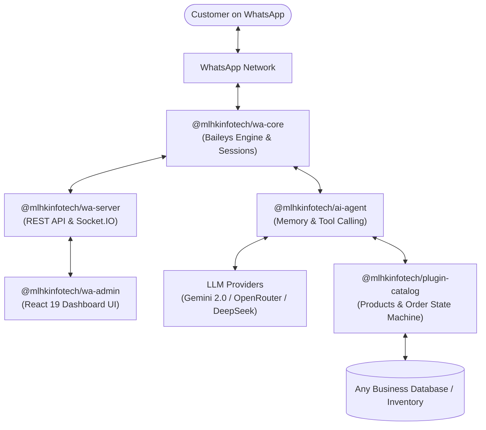

# 🚀 MLHK AI WhatsApp Ecosystem

[](https://github.com/mlhkinfotech/wacore/actions/workflows/ci.yml)
[](https://github.com/mlhkinfotech/wacore/actions/workflows/publish.yml)
[](https://opensource.org/licenses/MIT)
[](https://nodejs.org/)

Enterprise-grade, modular, and multi-tenant WhatsApp AI Agent & Automation Platform built with TypeScript and Node.js. Designed for high reliability, custom business catalogs, multi-provider LLMs (Gemini & OpenRouter), visual web dashboards, and turnkey CLI scaffolding.

---

## 📦 Packages in this Ecosystem

All packages are published under the **`@mlhkinfotech`** organization scope on [npm](https://www.npmjs.com/org/mlhkinfotech):

| Package | Version | npm Link | Description |
|---|:---:|:---:|---|
| [`@mlhkinfotech/types`](./packages/types) | `1.0.1` | [](https://www.npmjs.com/package/@mlhkinfotech/types) | Shared TypeScript definitions & contracts |
| [`@mlhkinfotech/wa-core`](./packages/wa-core) | `1.0.1` | [](https://www.npmjs.com/package/@mlhkinfotech/wa-core) | Baileys WhatsApp Engine & Multi-Session manager |
| [`@mlhkinfotech/ai-agent`](./packages/ai-agent) | `1.0.1` | [](https://www.npmjs.com/package/@mlhkinfotech/ai-agent) | Multi-provider LLM brain, memory & tool registry |
| [`@mlhkinfotech/plugin-catalog`](./plugins/plugin-catalog) | `1.0.1` | [](https://www.npmjs.com/package/@mlhkinfotech/plugin-catalog) | Universal Business & Product Catalog Plugin |
| [`@mlhkinfotech/wa-server`](./packages/wa-server) | `1.0.2` | [](https://www.npmjs.com/package/@mlhkinfotech/wa-server) | Turnkey REST API & WebSocket real-time server |
| [`@mlhkinfotech/wa-admin`](./packages/wa-admin) | `1.0.1` | [](https://www.npmjs.com/package/@mlhkinfotech/wa-admin) | React 19 + Vite Live Admin Dashboard & Sandbox |
| [`@mlhkinfotech/wa-cli`](./packages/wa-cli) | `1.0.2` | [](https://www.npmjs.com/package/@mlhkinfotech/wa-cli) | Scaffolding & Bot Runner CLI (`mlhk-wa` / `wa-cli`) |

---

## 🏗️ Architecture Overview



---

## ⚡ Instant Setup with CLI

The fastest way to build a client bot is via the official CLI:

```bash
# 1. Create a new client bot project
npx @mlhkinfotech/wa-cli create my-store-bot

# 2. Navigate to project
cd my-store-bot

# 3. Add your Gemini or OpenRouter key to .env
# AI_API_KEY=your_key_here

# 4. Start the bot
npm run dev
```

---

## 🛠️ Programmatic Usage

```typescript
import { WhatsAppEngine } from '@mlhkinfotech/wa-core';
import { AIAgent } from '@mlhkinfotech/ai-agent';
import { CatalogPlugin, MemoryCatalogAdapter } from '@mlhkinfotech/plugin-catalog';

// 1. WhatsApp Connection
const bot = new WhatsAppEngine({
  sessionId: 'client-1',
  sessionPath: './sessions/client-1'
});

// 2. Business Catalog
const catalog = new MemoryCatalogAdapter({
  id: 'store_1',
  name: 'MLHK Smart Store',
  currency: 'INR',
  products: [
    { id: '1', name: 'Web Development Plan', price: 9999, inStock: true },
    { id: '2', name: 'WhatsApp AI Automation', price: 14999, inStock: true }
  ]
});

// 3. AI Brain
const agent = new AIAgent({
  provider: 'gemini',
  apiKey: process.env.AI_API_KEY!,
  systemPrompt: 'You are an intelligent business consultant for MLHK Smart Store.'
});

// Attach catalog search tool to AI
const plugin = new CatalogPlugin(catalog);
agent.registerTool(plugin.getSearchTool());

// 4. Message Pipeline
bot.on('message', async (msg) => {
  if (msg.fromMe || !msg.text) return;

  const result = await agent.process({
    contactId: msg.from,
    contactName: msg.fromName,
    message: msg.text
  });

  if (result.reply) {
    await bot.sendMessage(msg.from, result.reply);
  }
});

await bot.start();
```

---

## 🖥️ Live Admin Dashboard UI (`@mlhkinfotech/wa-admin`)

Manage WhatsApp connections and AI configurations visually without code:

```bash
# Start backend server
pnpm --filter @mlhkinfotech/wa-server start

# Start frontend dashboard (http://localhost:5173)
pnpm --filter @mlhkinfotech/wa-admin dev
```

- 📱 **Live QR Code Scanner**: Scan WhatsApp web QR codes visually.
- 🤖 **AI Playground**: Test agent responses before publishing live.
- 💬 **Live Feed**: Monitor active WhatsApp customer conversations.
- 📢 **Broadcast Campaign**: Send notifications with anti-ban delay throttling.

---

## 🔄 CI/CD & GitHub Actions

Automated CI/CD pipelines are configured in `.github/workflows`:

1. **Continuous Integration (`ci.yml`)**:
   - Triggers on push and pull requests to `main`.
   - Runs linting, typechecking (`tsc`), full monorepo build, and unit tests across Node.js 20 and 22.

2. **Continuous Publishing (`publish.yml`)**:
   - Triggers automatically whenever a git release tag (`v*`) is pushed, or via manual dispatch.
   - Builds all packages and publishes with public access to the npm registry using `NPM_TOKEN`.
   - Creates an automated GitHub Release with release notes.

To publish a new version:
```bash
git tag v1.0.3
git push origin v1.0.3
```

---

## 🤝 Contributing

1. Fork the repository: [https://github.com/mlhkinfotech/wacore](https://github.com/mlhkinfotech/wacore)
2. Create your feature branch (`git checkout -b feature/amazing-feature`)
3. Commit your changes (`git commit -m 'feat: add amazing feature'`)
4. Push to the branch (`git push origin feature/amazing-feature`)
5. Open a Pull Request

---

## 📄 License

MIT © [MLHK Infotech](https://github.com/mlhkinfotech)
